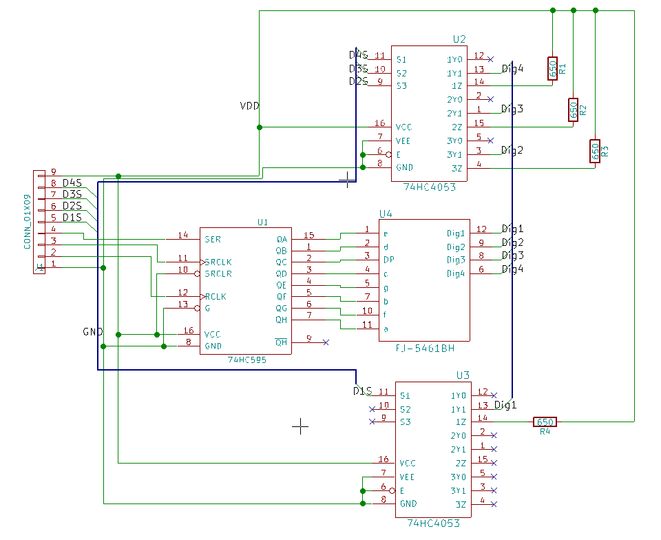
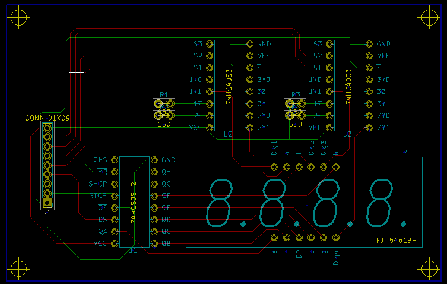

# 4 digit 8 segment display (FJ-5461BH) example usage in VHDL

Simple proof of concept on how to manipulate a 4 digit display (7 segment + DP) using a FPGA (7 pins), a 8-bit SIPO register and two 3-channel multiplexers.

### Notes:

Example pin assignments for DE0 Nano:
* CLOCK 50: R8

Register (74HC595):
* CLK: R13 (SHCP/SRCLK)
* LATCH: T11 (STCP/RCLK)
* DATA: R12 (DS/SER)

Multiplexers (74HC4053):
* MLTPLX_CH 0: T10 (#1 S1/D1S)
* MLTPLX_CH 1: R11 (#1 S2/D2S)
* MLTPLX_CH 2: P11 (#2 S1/D3S)
* MLTPLX_CH 3: R10 (#2 S2/D4S)

Below is a circuit and pcb design that can be used with this example:  

Example pin mapping for the above circuit and a DE0 Nano (GPIO-1):
* PIN 1: GND
* PIN 2: GPIO_17
* PIN 3: GPIO_14
* PIN 4: GPIO_16
* PIN 5: GPIO_111
* PIN 6: GPIO_110
* PIN 7: GPIO_109
* PIN 8: GPIO_108
* PIN 9: VCC

In order to run a simulation, set the Library (in project files properties) to "utils" for all files added from within the "utils" subdirectory.
